<div align="center">

# 贵傩戏 · GUI NUO OPERA

**傩文化数字博物馆 · 数字展陈交互体验**

Nuo Culture Digital Museum · Digital Exhibition & Interactive Experience

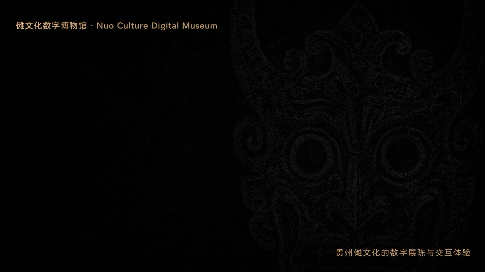

贵州傩戏面具的三维点云数字展馆 —— 纯浏览器运行，裸手手势交互，AR 试戴与打卡分享

**[在线体验](https://kingkazmax.github.io/nuo-culture-digital-museum/)** · [交互说明](docs/交互说明.md) · [性能与资产](docs/性能与资产.md)

</div>

---

## Overview · 概览

傩，是上古驱疫纳吉的仪式，傩戏被誉为「中国戏剧的活化石」，傩面具雕刻与傩戏表演是贵州最具代表性的非物质文化遗产之一。传统傩戏展演需要戏台、锣鼓与特定节庆场景，难以走进当代人的日常视野——本项目尝试回应这一困境。

「贵傩戏 · 傩文化数字博物馆」是一座开在浏览器里的展馆：五面贵州傩戏面具以每面 65,536 点的实时点云陈列于纯白数字展厅。观展不隔玻璃：手掌移动即可旋转藏品，挥手切换展品，握拳令傩面爆散为星尘；点击「AR 试戴」，面具即刻附着在镜头中的人脸上，挥手换面、拍照打卡、生成海报分享；也可以让语音向导自动讲解傩的历史与形制。无需安装任何应用，打开网页即可观展。

- **让非遗「可及」**：一个链接即可观展，突破地域与展演场景限制
- **让非遗「可玩」**：手势、AR 试戴与打卡分享的参与式观展，在互动中建立情感联结
- **让非遗「可存」**：65,536 点/面的三维点云为面具建立可精确度量的数字档案
- **让非遗「可传」**：全部开源，支持上传自有模型扩展馆藏，可作美育课件、数字展厅与形态研究素材

## 应用形态 · 三端一体

本项目源于实体交互装置的创作实践，同一套面具点云资产与交互语言，覆盖三种应用形态：

| 形态 | 场景 | 说明 |
|---|---|---|
| 交互装置 | 展馆 / 展会 / 商业空间大屏 | 摄像头捕捉观众手势，点云面具实时响应，握拳触发星尘爆散 |
| Web 数字馆 | 桌面浏览器 | 完整展馆体验：画廊选面、手势观展、AR 试戴、打卡分享 |
| 移动端 | 手机浏览器 | 自拍试戴 + 打卡海报生成与社交分享，触控目标 ≥44px，适配安全区与横屏 |

### 交互装置演示

| 主视觉 | 手势追踪 | 星尘爆散 |
|:---:|:---:|:---:|
| 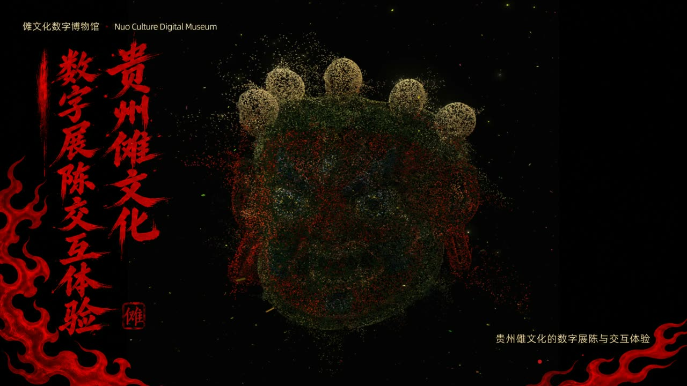 | 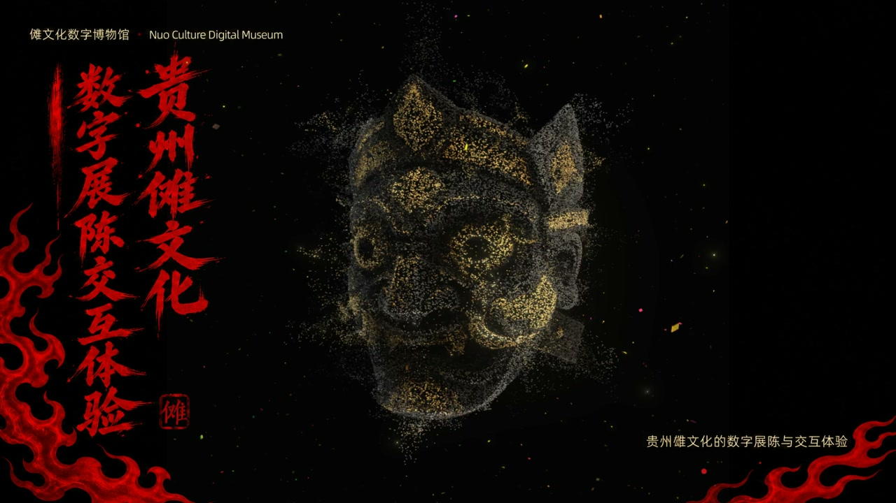 | 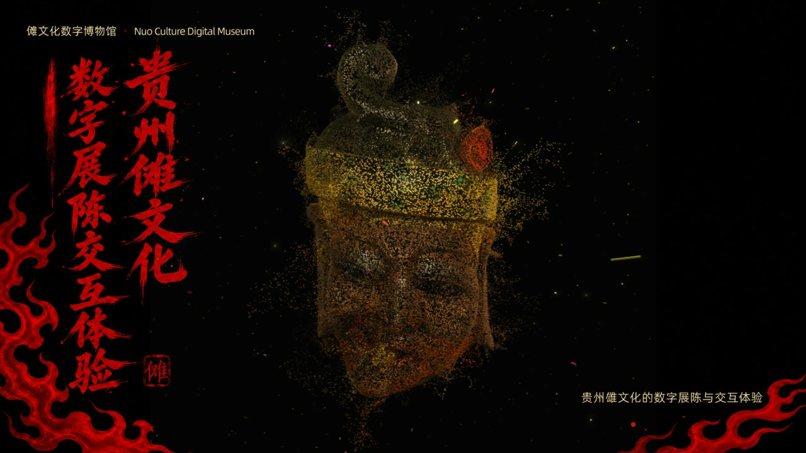 |

装置端以摄像头实时捕捉手部骨架（21 关键点 × 双手），驱动点云面具旋转、切换与爆散；上图为现场演示记录。

<details>
<summary>装置单面具点云渲染（展开查看）</summary>

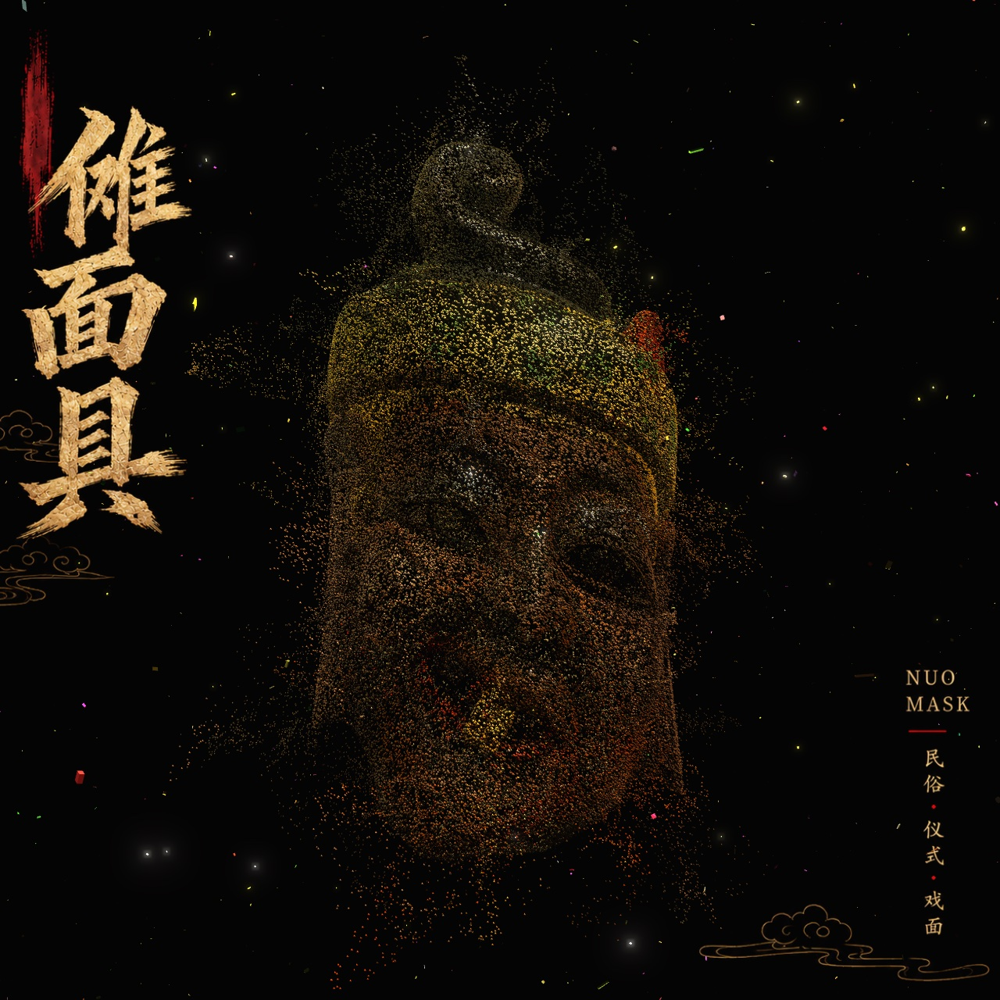

单面 65,536 点，f32 位置 + 颜色全精度存档，gzip 压缩传输。

</details>

## Screenshots · Web 端截图

| 馆藏画廊 | 展厅观展 | AR 试戴 | 打卡海报 |
|:---:|:---:|:---:|:---:|
| 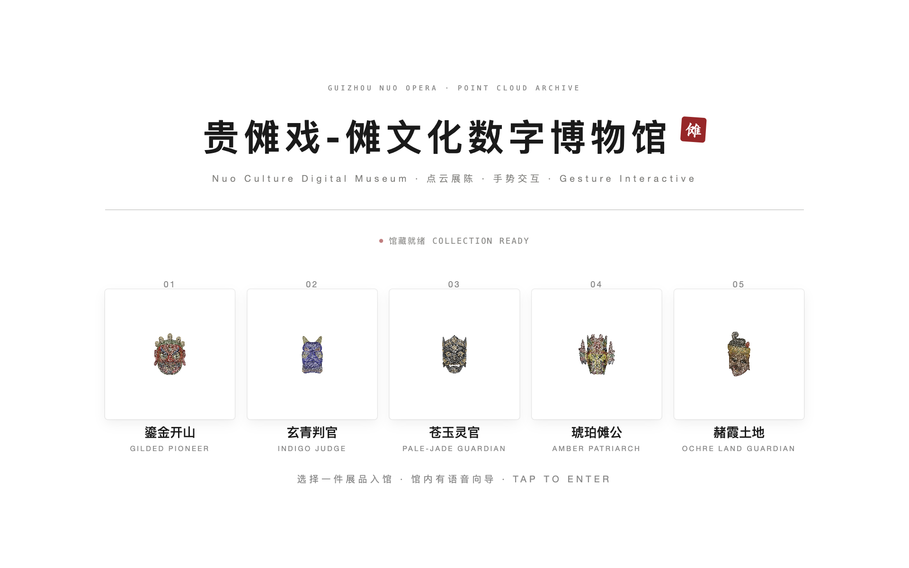 | 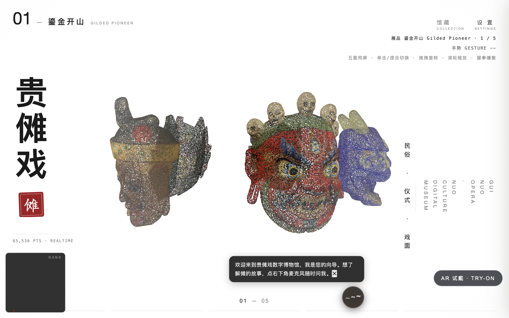 | 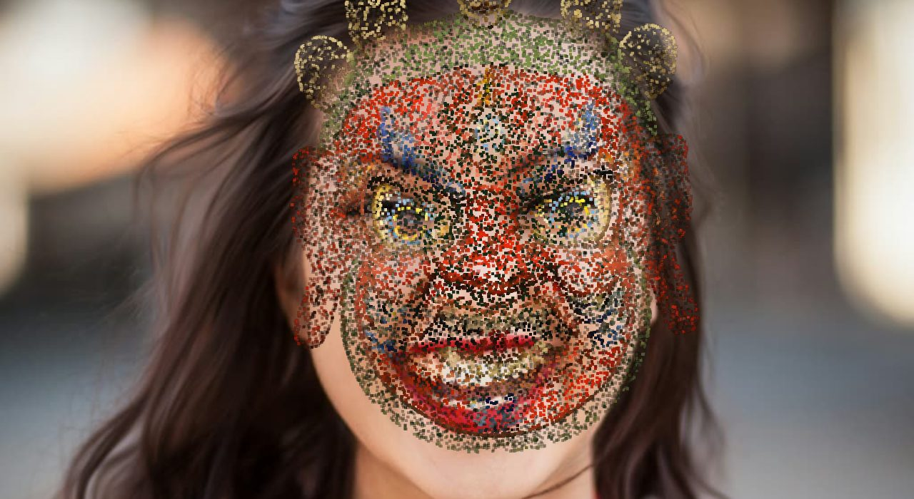 | 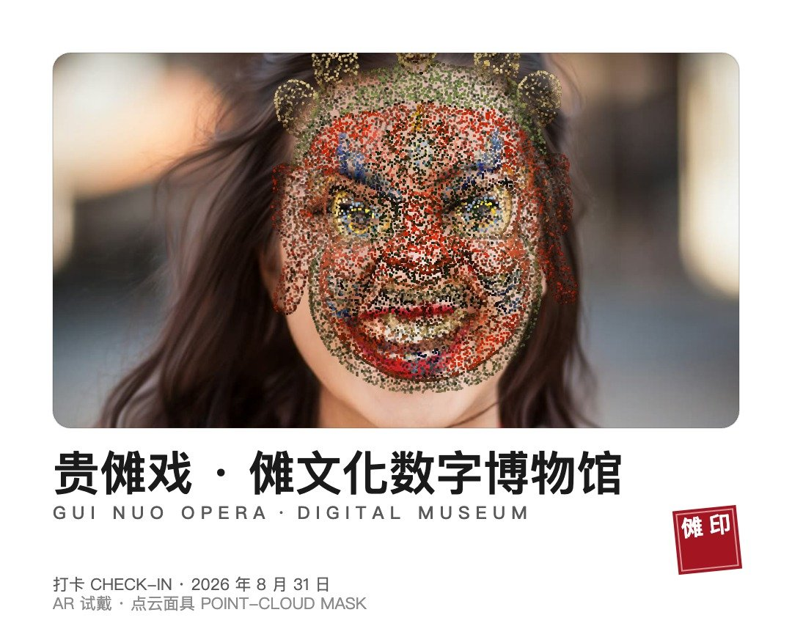 |

- **馆藏画廊**：五面傩面缩略图陈列，点击进馆
- **展厅观展**：纯白展厅 + 彩色点云面具 + 中英双语铭牌 + 底栏进度刻度
- **AR 试戴**：24,000 抽样点实时附着人脸，额头至下巴全覆盖，One Euro 滤波平滑跟随
- **打卡海报**：白卡版式（视频帧 + 面具层圆角内嵌），无衬线中英双语标签 + 朱砂傩印 + 日期，一键分享或保存

### 移动端

| 馆藏画廊 | 展厅观展 | AR 试戴 |
|:---:|:---:|:---:|
| 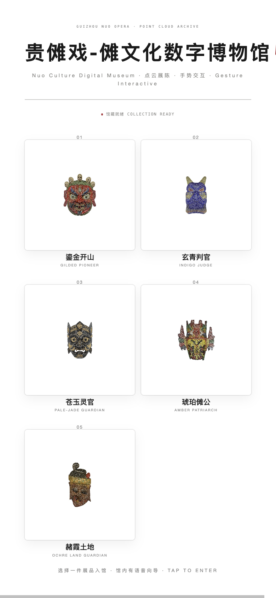 | 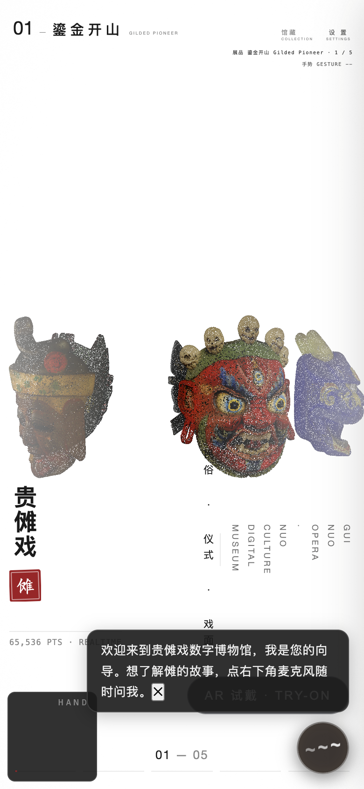 | 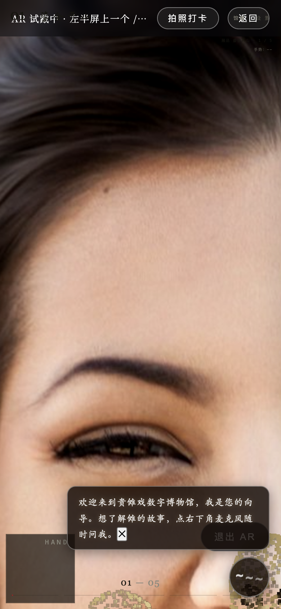 |

## Interactions · 交互指南

### 展厅观展（鼠标 / 触屏 / 手势三套并行）

| 操作 | 鼠标 / 触屏 | 手势（摄像头） | 效果 |
|---|---|---|---|
| 进馆 | 点击画廊卡片 | — | 进入展厅，自动播欢迎语与讲解 |
| 旋转观瞧 | 拖拽（带惯性） | 手掌移动 | 藏品跟随旋转 |
| 切换展品 | 单击画面 | **挥手** / **捏合** | 立即切换上一件 / 下一件，无过渡 |
| 缩放 | 滚轮 / 双指 | 双手拉距 | 0.45–2.6 倍视野缩放 |
| 爆散星尘 | — | **握拳** | 傩面爆散为星尘云雾，松手回聚 |
| 编辑展签 | 双击画面文字 | — | 就地修改标题与副题，失焦保存 |

无操作时藏品以默认速度缓慢自转；摄像头为可选项，可在设置面板开启。

### AR 试戴与打卡

1. 点击右下角「**AR 试戴**」按钮，授权摄像头
2. 面具以虹膜等五官锚点自动附着画面中的人脸（额头—下巴全覆盖，转头平滑跟随；侧脸超过阈值自动淡出避免错位）；每面面具内置独立贴合档案，开发者可访问 `?arcalib=1` 进入可视化校准模式
3. **挥手 / 捏合**切换面具，或点击画面**左半屏上一个 / 右半屏下一个**
4. 点击顶部「**拍照打卡**」，生成竖版打卡海报
5. 系统分享面板直接分享（支持 AirDrop / 社交应用），或长按 / 下载保存

手势识别带置信度门槛、起流预热与触发冷却，远景多人或误检画面不会乱切；无人脸时提示「未检测到人脸 · 请正对镜头」。

### 语音向导

- 入馆自动播放欢迎语，随后每 24 秒自动轮播傩文化讲解（共 5 讲：什么是傩 / 面具起源 / 面具色彩 / 贵州傩戏 / 傩舞傩戏）
- 点击麦克风按钮说出问题，匹配 17 主题知识库播放对应讲解，识别与播放全程本地完成
- 讲解播放时背景音乐自动压低（ducking），右上角可跳过

完整手势参数、状态机与设置面板说明见 **[docs/交互说明.md](docs/交互说明.md)**。

## Quick Start · 快速开始

环境要求：Node.js ≥ 18（CI 与推荐环境为 20），现代浏览器（Chrome / Edge 最佳）。

```bash
git clone https://github.com/KINGKAZMAX/nuo-culture-digital-museum.git
cd nuo-culture-digital-museum

npm install
npm run dev       # 开发服务器 http://localhost:5188（--host 已开启，局域网可访问）
npm run build     # 构建产物输出至 dist/
npm run preview   # 本地预览构建产物（同 5188 端口）
```

说明：

- 首次进入自动加载模型与手势引擎；摄像头为可选项，进馆后可在设置面板开启
- 全部资源离线自托管（点云、手势与人脸模型、中文字体、语音、音乐），运行期不请求外网
- AR 试戴与打卡在支持 WebCodecs / Web Share 的现代浏览器体验最佳；移动端 Safari 支持「长按保存海报」回退

## Tech Stack · 技术架构

| 层 | 技术 | 说明 |
|---|---|---|
| 构建 | **Vite 5** | `base: './'` 相对路径，兼容任意子路径静态部署 |
| 渲染 | **Three.js 0.170** | 场景 / 相机 / EDL 深度增强 / 胶片颗粒与暗角后期 |
| 着色 | **原生 GLSL ShaderMaterial** | 自定义点云着色器：噪声爆散、星尘闪烁、点尺寸透视衰减 |
| 手势 | **MediaPipe GestureRecognizer** | 21 点骨架 × 2 手，wasm 本地推理（GPU delegate） |
| AR | **MediaPipe FaceLandmarker** | 478 点人脸网格本地推理，视频流复用（iOS 单流约束友好） |
| 贴脸绑定 | **五官锚点刚体绑定 + One Euro 滤波** | 虹膜中线为面具眼线落点，每面面具内置独立贴合档案，24k 抽样全覆盖点径自适应 |
| 打卡合成 | **Canvas 2D + Web Share** | 镜像视频帧 + 面具层同比例对位合成海报，`navigator.share(files)` 分享 |
| 语音 | **Web Speech API + 预生成离线语音** | 麦克风识别（zh-CN）+ Piper 预合成讲解音频（18 段） |
| 数据 | **自研 TDPC 点云格式** | f32 全精度位置 + 颜色，gzip 传输，浏览器端解压 |
| 存储 | **IndexedDB / localStorage** | 用户上传展品 / UI 配置，刷新不丢 |
| 字体 | **系统无衬线栈 + 书法可选** | 默认 PingFang SC / Microsoft YaHei / Noto Sans SC 零下载；书法与宋体 @fontsource 子集按需注入 |

### 手势防误触设计

真实展厅环境复杂（远景多人、逆光、手部误检），手势链路内置多层防护：起流 1.2 秒预热、检测置信度 ≥ 0.5、挥手需连续两个采样窗口同向、捏合需先经历 5 帧张开「武装」再 3 帧捏合「触发」、触发后 0.6–0.7 秒冷却。经合成摄像头视频端到端验证：单次挥手恰好切换一次，无幽灵连切。

## Project Structure · 目录结构

```
nuo-culture-digital-museum/
├─ index.html              # 单页入口：舞台 + 展签层 + 顶栏/底栏 + HUD + 设置面板
├─ src/
│  ├─ main.js              # 启动编排、画廊/展厅视图、配置持久化、模型上传
│  ├─ scene.js             # Three.js 舞台：相机、后期、转台、背景星云
│  ├─ pointCloud.js        # 点云解压解析（TDPC/BPC1）+ 粒子着色器
│  ├─ handControl.js       # 手势 → 交互状态映射（防误触状态机）
│  ├─ arMask.js            # AR 试戴：人脸网格 → 刚体绑定贴脸渲染 + 打卡合成
│  ├─ modelConvert.js      # 浏览器端 PLY/GLB/OBJ → 点云
│  ├─ modelStore.js        # 内置 + 用户展品注册表（IndexedDB）
│  ├─ idb.js               # IndexedDB 轻封装
│  ├─ style.css            # 宣纸色数字馆 UI
│  └─ voice/               # 语音向导（知识库 kb.json + 状态机 voice.js）
├─ tools/                  # Node 端资产管线脚本
├─ public/
│  ├─ models/              # 五面傩面 + 双层背景点云（.tdp.gz）+ manifest.json
│  ├─ audio/               # 背景音乐 + 18 段讲解语音
│  ├─ mediapipe/           # wasm 运行时 + 手势/人脸模型（离线自托管）
│  ├─ fonts/               # 6 款离线中文字体
│  └─ assets/              # 静态图片
├─ docs/                   # 项目文档 + 截图与海报素材（docs/images/）
└─ .github/workflows/      # GitHub Pages 自动部署
```

## Deployment · 部署

已配置 GitHub Actions 自动部署（`.github/workflows/deploy.yml`）：

1. push 到 `main` 分支（或手动触发 `workflow_dispatch`）
2. Actions 执行 `npm ci` + `npm run build`，将 `dist/` 发布至 GitHub Pages
3. 在线地址：<https://kingkazmax.github.io/nuo-culture-digital-museum/>

前置设置：仓库 Settings → Pages → Source 选择 **GitHub Actions**（仅需一次）。Vite 已配置 `base: './'` 相对路径，天然兼容 Pages 子路径；`dist/` 亦可直接部署到任意静态托管（Nginx / OSS / Vercel 等），或封装为展馆现场装置的展示端。

## 美术资产与海报

| 易拉宝海报 | 横版主视觉 |
|:---:|:---:|
| 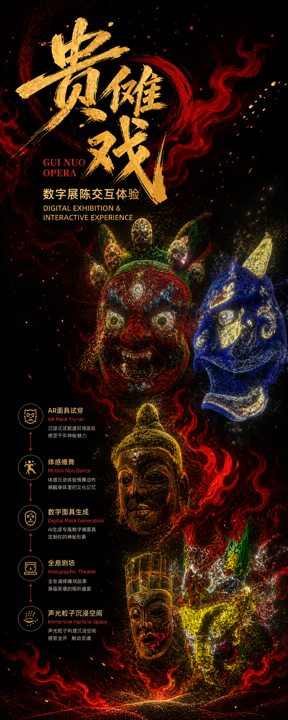 |  |

展陈视觉体系：黑金红粒子主视觉、纯白展厅 UI、无衬线中英双语标签、朱砂印章点缀；五面展品铭牌——**鎏金开山 / 玄青判官 / 苍玉灵官 / 琥珀傩公 / 赭霞土地**。全部点云资产、字体、语音、音乐离线自托管，可整体复用于线下展陈。

## Documentation · 更多文档

- [docs/交互说明.md](docs/交互说明.md) —— 完整交互文档：鼠标 / 触屏 / 手势三类输入的参数细节、语音问答状态机、设置面板逐项说明
- [docs/性能与资产.md](docs/性能与资产.md) —— TDPC 点云资产格式、加载与缓存策略、manifest 字段、用户模型持久化与性能预算

## Cultural Value · 非遗价值

傩是上古驱疫纳吉之仪式，傩戏被誉为「中国戏剧活化石」。黔地德江傩堂戏、安顺地戏、威宁撮泰吉均为国家级非物质文化遗产。傩面「以色喻德」：红表忠勇、黑表刚直、金表神异。本馆以数字点云为刻刀，让更多人隔屏照面千年傩韵：

- **数字化保存**：高精度点云为传世面具建立可度量、可复用、可再创作的数字档案，应对木质面具随岁月剥蚀失真的保存难题
- **活态传播**：从「隔着玻璃看」到「戴在脸上拍」，AR 试戴与打卡分享让年轻人主动成为傩文化的传播节点
- **教育普惠**：纯浏览器运行、零安装门槛，可直接用作中小学美育课件与高校民间美术研究素材
- **创作延续**：开源格式与模型上传通道开放，面具雕刻技艺可借助数字工具续写新形态

## Business Value · 商业价值与变现路径

| 路径 | 形态 | 客群与场景 |
|---|---|---|
| 文旅展陈落地 | 展馆 / 景区 / 商业综合体数字展项定制 | 博物馆、非遗馆、游客中心、商场中庭大屏互动装置 |
| 数字文创 | AR 试戴打卡海报、面具数字藏品、节庆限定皮肤 | 景区游客社交分享、线上文化传播活动 |
| 教育课程 | 非遗美育课件、研学工作坊配套数字工具 | 中小学美术课、高校非遗研究、研学旅行机构 |
| IP 授权 | 五面傩面点云形象授权（包装 / 联名 / 游戏素材） | 文创品牌、游戏与动画 studio、地方特产包装 |
| 技术服务 | 点云采集与转换管线、Web 3D 展陈开发 | 非遗工坊、美术馆、文物数字化项目 |

成本结构优势：纯静态托管（GitHub Pages / OSS）零服务器成本；点云资产 gzip 后单面约 1.1–1.25 MB，移动网络加载顺畅；全部推理在端侧完成，无 API 调用费用，规模化边际成本趋近于零。

## Guizhou Tourism · 与贵州文旅的结合

贵州是全国傩文化保存最完整的省份之一，「中国傩戏之乡」德江、安顺屯堡地戏、威宁撮泰吉构成独特的傩文化带。本项目的结合路径：

1. **景区数字展馆**：落地德江傩堂戏博物馆、安顺屯堡文化景区游客中心，作为常设数字展项，弥补实体展演场次有限的空档
2. **打卡引流**：游客 AR 试戴生成打卡海报分享至社交平台，自带贵州傩文化标识，形成「体验—分享—引流」闭环
3. **节庆活动**：傩文化节、数博会、旅发大会等展会现场交互装置，聚拢人气、传播黔文化名片
4. **研学线路**：与「傩面具雕刻工坊 + 数字馆体验」组合成非遗研学产品，学生先看展、再试戴、后动手刻面具体验完整文化链路
5. **文创衍生**：五面展品铭牌形象转化为面具书签、冰箱贴、盲盒等实体文创，数字馆扫码即达

## Roadmap · 落地推广规划

- **第一阶段 · 线上传播（当前）**：线上数字馆开放体验，小红书 / 视频号等平台演示内容投放，赛事展示（多彩贵州·贵客松 AI 应用场景共创赛），收集用户反馈迭代
- **第二阶段 · 试点落地**：对接 1–2 个景区或展馆做数字展项试点，验证大屏装置 + 手机打卡的现场动线与停留时长
- **第三阶段 · 规模推广**：形成「数字展项定制 + 数字文创 + 研学课程」的产品组合，拓展至更多非遗门类（苗族银饰、蜡染等复用同一技术底座）

## Event · 赛事

多彩贵州·贵客松 AI 应用场景共创赛（2026 数博会配套活动）参赛作品。GitHub 仓库 Tag：[`Guikesong`](https://github.com/KINGKAZMAX/nuo-culture-digital-museum/releases/tag/Guikesong)

## License · 许可

MIT
